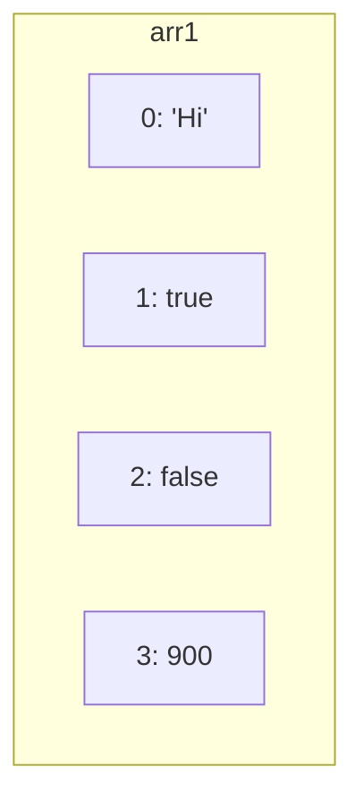

# Javascript Interview Questions

<div style="text-align: justify">

## Arrays:

### Explain Array and Traversal in Array:

Normally when you have a variable it can store only one value.
```javascript
let a = 10; // value of 10 stored in variable a
a = 20; // value is overwritten
```
It means at a time only one value is stored. When you want to store values under one name, then you can use an array.
Array is available in all programming languages. Few languages support only specific type of array. For example an
array of integers cannot have string values. In javascript we have array which can store any type of value. In
javascript we have an **Array** class and arrays are the prototype of this class.
```javascript
let arr0 = [4, 7, 9];       // [4, 7, 9]
let arr1 = ["Hi", true, false, 900];        // ["Hi", true, false, 900]
```
Let's try to understand internally what actually happens:

0 is lower index(boundary) and 3 is upper index(boundary). This array has 4 elements. We can use **length** property in
order to get total number of elements that an array has:
```javascript
console.log(arr1.length);   // 4
```
Referring one specific element of an array using its index value:
```javascript
console.log(arr1[0]);   // Hi
```
Or if we want to access to the last element of an array, we can do this like the following:
```javascript
let arr2 = [1, 2, 3, 4, 5, 6];
// In old school javascript:
console.log(arr2[arr2.length - 1]);
// In ECMAScript 2022 or later:
console.log(arr2.at(-1));
```
We can have an array of object literals. Let's see an example:
```javascript
let products = [
    {productId: "00001", productName: "Iphone"},
    {productId: "00002", productName: "IWatch"},
    {productId: "00003", productName: "MacBook"},
];

console.log(products);
/*
[
    {productId: "00001", productName: "Iphone"},
    {productId: "00002", productName: "IWatch"},
    {productId: "00003", productName: "MacBook"},
]
 */
```
Once again referring a specific element:
```javascript
console.log(products[2]);   // {productId: "00003", productName: "MacBook"}
```
We also can access to elements properties:
```javascript
console.log(prducts[2].productName);    // MacBook
```

Traversal in an Array:  
Traversal means we are going to navigate through an array. we will begin with the most traditional way which is loop
till the last element; Let's see an example:
```javascript
let arr = ["ES5", "ES6", "ES7"];
for (let i = 0; i < arr.length; i++) console.log(arr[i]);
/*
ES5
ES6
ES7
 */
```
In ES6 onwards we have **for...in** and **for...of** to loop through an array:
```javascript
let arr1 = ["ES5", "ES6", "ES7"];
for (let ind in arr1) console.log(ind); // for...in loop returns the indexes
/*
0
1
2
 */

for (let el of arr1) console.log(el);   // for...of loop returns the actual values
/*
ES5
ES6
ES7
 */
```
There are several method to loop through an array. but at this time we just want to see **forEach** method which
receives a callback function:
```javascript
let arr = ["es5", "es6", "es7"];
arr.forEach((elementItself, elementIndex) => console.log(elementItself, elementIndex));
/*
es5 0
es6 1
es7 2
 */
```
The callback function inside the forEach loop actually takes 4 parameters as the following:
```javascript
let arr = ["es5", "es6", "es7"];
class JS {};
arr.forEach(function (elementItself, elementIndex, arrayItself, thisKeywordForCallBack=JS) {
    console.log(`${elementItself}   ${elementIndex}   ${arrayItself}   ${thisKeywordForCallBack}`);
})

/*
es5   0   es5,es6,es7   class JS {}
es6   1   es5,es6,es7   class JS {}
es7   2   es5,es6,es7   class JS {}
 */
// Fourth parameter inside callback function is not available for arrow functions.
```
forEach method cannot be stopped in between like you break the loop.

#### *Relative Questions*:

**What is the difference between for...in and for...of loop?**  
for...in loop will display the index number while for...of loop will refer the actual value of elements.

**What will be the output of the following code?**
```javascript
let arr = ["ES5", "ES6", "ES7", "ES8"];
arr.forEach(function (element, index) {
    console.log(element, index);
    if (index === 2) {
        break;  // Uncaught SyntaxError: Illegal break statement
    }
});
```
You can not break the forEach loop, and it is going to loop till the entire array.

**What will be the output of the following code?**
```javascript
let arr = [7, 9, 0];
console.log(arr[arr.length]);   // Undefined
```
This will display the *undefined* as a result.

---

### Array Element Manipulation:

Adding and removing elements in an array:
There are 4 most known methods that we can use to add or remove elements; *push()*, *pop()*, *shift* and *unshift*.
*push()* and *unshift()* are used to add elements. *push()* method adds one or more elements at the end of an array and
returns the new length; count of elements after adding elements. *unshift()* method adds one or more elements at the
beginning of an array and returns the new length; cont of elements after adding elements. *pop()* and *shift* are used
to remove elements. *pop()* method removes the last element of array, and it returns that removed element. *shift()*
method removes the first element of array, and it returns that removed element.
```javascript
const arr = ["one", "two", "three", "four", "five"];

console.log(arr.push("six"));   // 6
console.log(arr);   // ["one", "two", "three", "four", "five". "six"]

console.log(arr.unshift("zero"));   // 7
console.log(arr);   // ["zero", "one", "two", "three", "four", "five", "six"]

console.log(arr.pop());     // "six"
console.log(arr);   // ["zero", "one", "two", "three", "four", "five"]

console.log(arr.shift());   // "zero"
console.log(arr);   // ["one", "two", "three", "four", "five"]
```
Let's talk about an important method in arrays which is called *splice()* method. This method depending on what
parameters it takes, can add, insert, replace or even remove on or more elements. It also returns all the deleted
elements. Here is its syntax:
```javascript
arrName.splice(start, deleteCount, items);
// Start: Zero-based index at which to start changing the array
// deleteCount: Optional - An integer indicating the number of elements in the array to remove from start
// items: Optional - The elements to add to the array, beginning from start
```
Let's see a couple of examples:
```javascript
let arr = ["one", "two", "three", "four", "five"];
console.log(arr.splice(2));     // ["three", "four", "five"]
console.log(arr);   // ["one", "two"]

arr = ["one", "two", "three", "four", "five"];
console.log(arr.splice(2, 1));      // ["three"]
console.log(arr);   // ["one", "two", "four", "five"]

arr = ["one", "two", "three", "four", "five"];
console.log(arr.splice(2, 1, "New"));      // ["three"]
console.log(arr);   // ["one", "two", "New", "four", "five"]

arr = ["one", "two", "three", "four", "five"];
console.log(arr.splice(2, 1, "New", "Another"));      // ["three"]
console.log(arr);   // ["one", "two", "New", "Another", "four", "five"]

arr = ["one", "two", "three", "four", "five"];
console.log(arr.splice(2, 0, "New", "Another"));      // []
console.log(arr);   // ["one", "two", "New", "Another", "three", "four", "five"]

// Behave like push method:
arr = ["one", "two", "three", "four", "five"];
console.log(arr.splice(arr.length, 0, "New"));      // []
console.log(arr);   // ["one", "two", "three", "four", "five", "New"]

// Behave like unshift method:
arr = ["one", "two", "three", "four", "five"];
console.log(arr.splice(0, 0, "New"));      // []
console.log(arr);   // ["New", "one", "two", "three", "four", "five"]
```
*splice()* method is a fantastic way to deal with various types of operations within an array, but it changes the
original array which isn't very good practice in some cases.

#### *Relative Questions*:

**What is the difference between push() and unshift() methods?**  
*push()* method adds the element at the end of an array whereas *unshift()* method adds element at the beginning.

**What is the difference between pop() and shift() methods?**  
*pop()* method remove the element from the end of an array whereas *shift()* method removes element from the beginning.

**How can you insert an element at the given position?**  
*splice()* method is used to insert an element at a given position:
```javascript
arr.splice(0, 0, "New Element");
```

**How can you remove a specific element?**  
*splice()* method is used to remove a specific element:
```javascript
arr.splice(2, 1);
```

**What does splice() method return?**  
*splice()* method returns deleted items, If there is nothing to delete then it will return an empty array.

---

### Search Operation on Array:

Searching elements in an array is a very common task in programming. Javascript gives us various methods to perform
search. We will begin with these three methods: *indexOf()*, *lastIndexOf()* and *includes()*  
Here are their syntax:
```javascript
arr.indexOf(searchElement, fromIndex);
/*
This method returns the first index at which a given element can be found in the array, or -1 if it is not present.

searchElement: Element to locate in the array
fromIndex: Zero-based index at which to start searching - default value is 0
 */
```
```javascript
arr.lastIndexOf(searchElement, fromIndex);
/*
This method returns the last index at which a given element can be found in the array, or -1 if it is not present.
The array is searched backwards, starting at fromIndex.

searchElement: Element to locate in the array
fromIndex: Zero-based index at which to start searching backwards - default value is arr.length - 1
 */
```
```javascript
arr.includes(searchElement, fromIndex);
/*
This method determines whether an array includes a certain value among its entries, returning true or false as 
appropriate.

searchElement: The value to search for
fromIndex: Zero-based index at which to start searching - default value is 0
 */
```
Let's see the couple of examples:
```javascript
let arr = ["one", "two", "one", "three", "four", "one", "five"];
console.log(arr.indexOf("one"));    // 0
console.log(arr.indexOf("one", 3));    // 5
console.log(arr.indexOf("One", 3));     // -1 - Because indexOf() search is case sensitive
console.log(arr.lastIndexOf("one"));    // 5
console.log(arr.lastIndexOf("one", 3));     // 2
console.log(arr.includes("ne"));    // false
```
There are other methods such as *find()*, *findIndex()* and *filter()*. Let's see couple of examples:
```javascript
/*
find() method returns the first element in the provided array that satisfies the provided testing function. If no values
satisfy the testing function, undefined is returned. find() method takes a callback function as its parameter; callback
function itself takes four parameters as follows: element, index, array, thisArg
    element: The current element being processed in the array
    index: The index of the current element being processed in the array
    array: The array find() was called upon
    thisArg: Optional - A value to use as this when executing callbackFn
*/
const arr = [2300, 4500, 5600, 7800, 1200];
const result = arr.find(elem => elem > 3000);
console.log(result);    // 4500
```
```javascript
/*
findIndex() method returns the index of the first element in an array that satisfies the provided testing function.
If no elements satisfy the testing function, -1 is returned. find() method takes a callback function as its parameter;
callback function itself takes four parameters as follows: element, index, array, thisArg
    element: The current element being processed in the array
    index: The index of the current element being processed in the array
    array: The array findIndex() was called upon
    thisArg: Optional - A value to use as this when executing callbackFn
*/
const arr = [2300, 4500, 5600, 7800, 1200];
const result = arr.findIndex(elem => elem > 3000);
console.log(result);    // 1
```
But the problem with these two methods is that they find one value at a time. Let's consider you want to get all the
values which are more than 3000, How would you that? The best way is to use *filter()* method:
```javascript
/*
filter() method creates a shallow copy of a portion of a given array, filtered down to just the elements from the given
array that pass the test implemented by the provided function. find() method takes a callback function as its parameter;
callback function itself takes four parameters as follows: element, index, array, thisArg
    element: The current element being processed in the array
    index: The index of the current element being processed in the array
    array: The array filter() was called upon
    thisArg: Optional - A value to use as this when executing callbackFn
*/
const arr = [2300, 4500, 5600, 7800, 1200];
const result = arr.filter(elem => elem > 3000);
console.log(result);    // [4500, 5600, 7800]
```
If there is no element in array that satisfies the filter() method condition, it will return an empty array:
```javascript
const arr = [2300, 4500, 5600, 7800, 1200];
const result = arr.filter(elem => elem > 30000);
console.log(result);    // []
```

#### *Relative Questions*:

**What is the difference between find() and filter() method?**  
find() method returns only one value which is the first match and then stops searching process while filter() method
returns a new array.

**If there is no value to return, what will findIndex() method return?**  
findIndex() method return *undefined*, if there is no true value matched.

**What is the difference between indexOf() and includes() method?**  
indexOf() method return only the index, while includes() method returns *true* or *false* which are the boolean values.

**How do you search multiple values in an array?**  
We can use *filter()* method in order to search multiple values in an array.

**What will be the output of this code?**  
```javascript
const arr = ["One", "Two", "Three", "Four", "Five"];
console.log(arr.lastIndexOf("Abcd"));
```
In case of *indexOf()* or *lastIndexOf()*, when the element is not found, it will return -1.

---

### The use of map() method:

The *map()* method creates a new array populated with the results of calling a provided function on
every element in the calling array. *map()* method takes a callback function as its parameter; callback
function itself takes four parameters as follows: element, index, array, thisArg
* element: The current element being processed in the array
* index: The index of the current element being processed in the array
* array: The array map() was called upon
* thisArg: Optional - A value to use as this when executing callbackFn

Let's see the couple of examples:
```javascript
const arr = [1, 2, 3, 4, 5];
const result = arr.map((elementItself, indexOfElement) => {
    console.log(`Element: ${elementItself}, index: ${indexOfElement}`)
});
/*
Element: 1, index: 0
Element: 2, index: 1
Element: 3, index: 2
Element: 4, index: 3
Element: 5, index: 4
 */
console.log(result);    // [undefined, undefined, undefined, undefined, undefined]
```
Let's consider we want to get squared of all elements:
```javascript
const arr = [1, 2, 3, 4, 5];
const newArr = arr.map(elem => elem * elem);
console.log(newArr);    // [1, 4, 9, 16, 25]
```
Note: *map()* method returns a new array, and it doesn't change the original one.

#### *Relative Questions*:

**Find the length of each element in a new array?**  
```javascript
const array = ["Apple", "Banana", "Orange"];
const results = array.map(element => element.length);
console.log(results);   // [5, 6, 6]
```

**Find the square root of every element and store it in a new array?**  
```javascript
const arr = [4, 16, 64];
const results = arr.map(element => Math.sqrt(element));
console.log(results);   // [2, 4, 8]
```

**Fetch all pNames in a new array?**  
```javascript
const products = [
    {pCode: 1, pName: "Apple"},
    {pCode: 2, pName: "Melon"},
    {pCode: 3, pName: "Banana"},
    {pCode: 4, pName: "BlueBerry"},
]
const productNames = products.map(element => element.pName);
console.log(productNames);  // ['Apple', 'Melon', 'Banana', 'BlueBerry']
```

---

### Flattening a 2D Array:

Flattening an array means converting a multi dimensional array(2D, 3D, ...) into a single dimensional array. In order
to do this, we have to use the *reduce()* method. Let's say we want to sum of all elements from the array, then it's
kind of an accumulative operation i.e, result is combined. So *reduce()* method loop through all the elements and helps
you to get one combined result such as sum, average or product. *reduce()* method takes a callback function  and  the
accumulator initial value as its parameters. Callback function itself takes four parameter as follows: accumulator,
currentValue, currentIndex and array:
* accumulator:  The value resulting from the previous call to callbackFn. On first call, initialValue if specified,
    otherwise the value of array[0].
* currentValue:  The value of the current element. On first call, the value of array[0] if an initialValue was
    specified, otherwise the value of array[1].
* currentIndex:  The index position of currentValue in the array. On first call, 0 if initialValue was specified,
    otherwise 1.
* array:  The array reduce() was called upon

Let's see the couple of examples:
```javascript
let arr = [1, 2, 3, 4, 5];
let result = arr.reduce((accumulator, currentValue) => accumulator + currentValue);
console.log(result);    // 15

result = arr.reduce((acc, currentValue) => acc + currentValue, 10);;
console.log(result);    // 25


result = arr.reduce((acc, currentValue) => acc * currentValue);;
console.log(result);    // product: 120

arr = [2, 4, 6, 8];
result = arr.reduce((acc, currentValue, index, array) => {
    acc += currentValue;
    if (index === arr.length - 1) return acc / arr.length;
    return acc;
});
console.log(result);    // average: 5
```

#### *Relative Questions*:

**How will you flatten an array?**  
```javascript
const arr = [
    [1, 2, 3],
    [4, 5, 6],
    [7, 8, 9],
];
const flatArr = arr.reduce((acc, curr) => acc.concat(curr));
console.log(flatArr);   // [1, 2, 3, 4, 5, 6, 7, 8, 9]
```

**Get the sum of all salaries of employees?**  
```javascript
const employees = [
    {eNo: 1111, eSalary: 10000},
    {eNo: 2222, eSalary: 20000},
    {eNo: 3333, eSalary: 30000},
    {eNo: 4444, eSalary: 40000},
];
const totalSalary = employees.reduce((acc, curr) => acc + curr.eSalary, 0);
console.log(totalSalary);   // 10000
```

**What is the difference between reduce() and reduceRight() method?**  
The *reduce()* method loops from 0th index till the last index of an array whereas *reduceRight()* method starts
looping from the last index to 0th index.
</div>